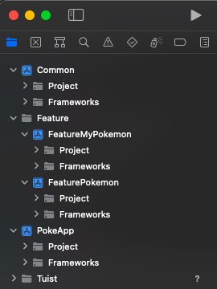
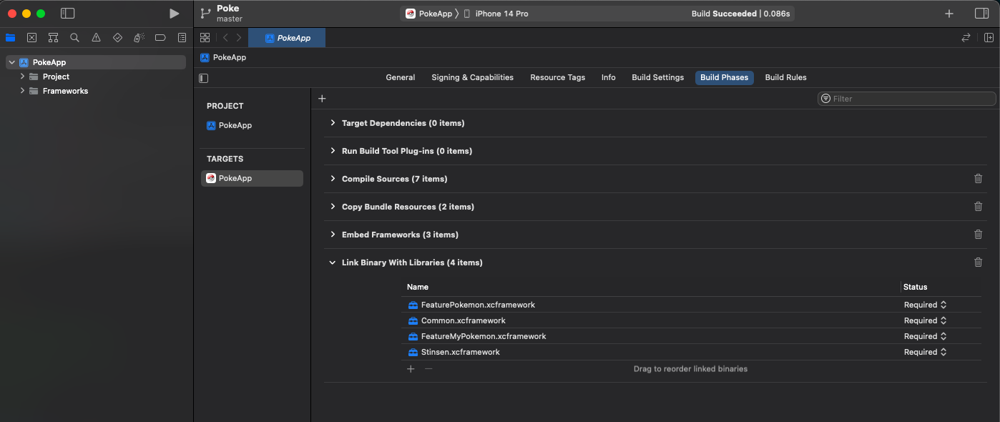
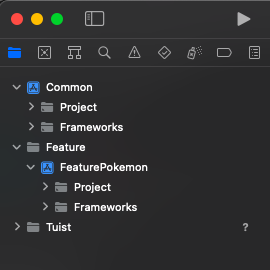

# poke-app

This simple pokemon app iOS application using Swift and SwiftUI also using micro-feature MVVM approach to modularisation based on Tuist, that fetches data from an [API](https://pokeapi.co/) and [poke-server](https://github.com/tbetmen/poke-server) as Localhost. 

## Features

 * **Pokemon List** page; should show a list of Pokemons’ names and picture. When a Pokemon is clicked, it should go to that Pokemon Detailpage.
 * **Pokemon Detail** page; should show a picture of the Pokemon with its attributes. And there is a button to catch the Pokemon (success probability is 50%), if success then user can give the Pokemon a nickname and add that Pokemon to ‘My Pokemon List’
 * **My Pokemon List** page; show a list (like Pokemon List page, but with each of their nicknames as well) of all Pokemons you have caught. It should also be possible to release and rename a Pokemon from the list on this page.

## Recording

<video width="700" height="500" src="https://github.com/tbetmen/poke-app/assets/40412728/d740d114-7fee-4c88-adc4-45a4506f3f53"></video>

## Running PokeApp

    1. Install tuist https://docs.tuist.io/tutorial/get-started

    2. $ tuist fetch

    3. $ tuist generate

Project Structure

## Running PokeApp with precompiled binary

Using tuist feature to allow this project to compiled PokeApp dependencies (external, feature, common) as xcframework.

    1. $ tuist fetch (ignore if already run this command)

    2. $ tuist cache warm --xcframeworks

    3. $ tuist generate PokeApp --xcframeworks

Project Structure

## Running specific Feature
This will only generate specific project and it's dependencies.

    1. $ tuist fetch (ignore if already run this command)

    2. $ tuist generate FeaturePokemon

Project Structure

## Author

Muhammad M. Munir [muhammadmmunir24@gmail.com](mailto:muhammadmmunir24@gmail.com)

## License

**MIT** : http://opensource.org/licenses/MIT